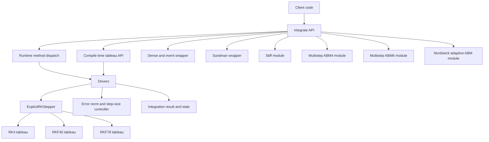

# orbitIntegrator

Author: Watson

C++20 explicit Runge-Kutta integrator for non-stiff ODEs:
- RK4 (fixed-step)
- RKF45 (embedded adaptive 4(5), fixed-step using high-order solution also supported)
- RKF78 (embedded adaptive 7(8), fixed-step using high-order solution also supported)
- RK8 alias (fixed-step using RKF78 high-order weights)
- Optional Sundman-transformed stepping mode (`integrate_sundman`)
- Dense output recording and simple event detection wrapper
- Separate stiff module (`ode::stiff::integrate_implicit_euler`)
- Separate multistep module (`ode::multistep::integrate_abm4`)
- Higher-order Adams method (`ode::multistep::integrate_abm6`)
- Nordsieck-style adaptive Adams (`ode::multistep::integrate_nordsieck_abm4`)

## Architecture



## Build and test

```bash
cmake --preset macos-debug
cmake --build --preset macos-debug -j
ctest --preset macos-debug --output-on-failure
```

## Sanitizer runs

AddressSanitizer:

```bash
cmake --preset macos-asan
cmake --build --preset macos-asan -j
ctest --preset macos-asan --output-on-failure
```

UndefinedBehaviorSanitizer:

```bash
cmake --preset macos-ubsan
cmake --build --preset macos-ubsan -j
ctest --preset macos-ubsan --output-on-failure
```

## Install and package consumption

```bash
cmake --preset macos-release
cmake --build --preset macos-release -j
cmake --install build/macos-release --prefix /tmp/ode-install
```

Downstream CMake usage:

```cmake
find_package(ode CONFIG REQUIRED)
target_link_libraries(your_target PRIVATE ode::ode)
```

The repository includes a package consumer smoke test (`ode_package_install_smoke`).

## API usage

Runtime method selection:

```cpp
#include <ode/ode.hpp>
#include <vector>

using State = std::vector<double>;
State y0{1.0};

auto rhs = [](double, const State& y, State& dydt) {
  dydt.resize(y.size());
  dydt[0] = y[0];
};

ode::IntegratorOptions opt;
opt.adaptive = true;
opt.rtol = 1e-10;
opt.atol = 1e-12;

auto res = ode::integrate(ode::RKMethod::RKF78, rhs, 0.0, y0, 1.0, opt);
```

Compile-time tableau selection:

```cpp
#include <ode/integrate_method.hpp>
#include <ode/tableaus/rkf45.hpp>

auto res = ode::integrate_with_tableau<ode::TableauRKF45>(rhs, t0, y0, t1, opt);
```

Optional Sundman mode (`dt/ds` provided by caller):

```cpp
auto dt_ds = [](double t, const State& y) {
  (void)t;
  return 1.0 + 0.01 * std::abs(y[0]);  // positive scale
};
auto res = ode::integrate_sundman(ode::RKMethod::RKF78, rhs, dt_ds, t0, y0, t1, opt);
```

Dense output + events:

```cpp
ode::DenseOutputOptions<State> dense_opt{};
dense_opt.uniform_sample_dt = 0.1;
ode::EventOptions<State> event_opt{};
event_opt.function = [](double, const State& y) { return y[0] - 0.5; };
auto out = ode::integrate_with_dense_events(ode::RKMethod::RKF45, rhs, t0, y0, t1, opt, dense_opt, event_opt);
```

Stiff module example:

```cpp
#include <ode/stiff/implicit_euler.hpp>
std::vector<double> y0{1.0};
auto stiff_res = ode::stiff::integrate_implicit_euler(rhs_stiff, 0.0, y0, 1.0);
```

Multistep Adams-Bashforth-Moulton example:

```cpp
#include <ode/multistep/adams_bashforth_moulton.hpp>
ode::multistep::AdamsBashforthMoultonOptions ms_opt;
ms_opt.h = 0.01;
ms_opt.mode = ode::multistep::PredictorCorrectorMode::PECE;  // PEC | PECE | Iterated
ms_opt.corrector_iterations = 2;  // used when mode == Iterated
auto ms_res = ode::multistep::integrate_abm4(rhs, t0, y0, t1, ms_opt);
```

Higher-order ABM6:

```cpp
auto ms6_res = ode::multistep::integrate_abm6(rhs, t0, y0, t1, ms_opt);
```

Nordsieck-style adaptive Adams:

```cpp
#include <ode/multistep/nordsieck_abm4.hpp>
ode::multistep::NordsieckAbmOptions nopt;
nopt.rtol = 1e-8;
nopt.atol = 1e-12;
auto nres = ode::multistep::integrate_nordsieck_abm4(rhs, t0, y0, t1, nopt);
```

## Simple 2-body orbital example

Build and run:

```bash
cmake --preset macos-debug
cmake --build --preset macos-debug -j
./build/macos-debug/ode_two_body_example
```

This integrates a circular LEO two-body problem for approximately one orbital period and prints final state and step stats.

## Profiling

```bash
tools/profile.sh
```

Optional overrides:
- `ODE_PERF_SAMPLES`
- `ODE_PERF_ITERATIONS`

## Method comparison benchmark

Build and run:

```bash
cmake --preset macos-debug
cmake --build --preset macos-debug -j
./build/macos-debug/ode_method_compare_benchmark
```

This prints a side-by-side comparison for:
- `RKF78(adaptive)`
- `ABM4-PEC`
- `ABM4-PECE`
- `ABM4-Iter2`
- `ABM6-Iter2`
- `Nordsieck-ABM4`
- `Sundman+RKF78`

Columns:
- `runs/sec` (throughput)
- `mean_abs_err` (mean terminal absolute error vs analytic reference)
- `mean_steps` (accepted steps)
- `mean_rhs` (RHS evaluations)

Optional overrides:
- `ODE_COMPARE_SAMPLES`
- `ODE_COMPARE_ITERATIONS`

## Tests included

- order checks (`RK4`, `RKF45`, `RKF78`, `RK8`)
- adaptive behavior and backward integration
- robustness guards (`NaN`, `max_steps`, endpoint clamp, underflow path)
- algebra adapters (`std::array`, custom accessor algebra)
- dense output + event handling
- stiff module smoke/regression
- multistep ABM4 regression/consistency checks
- multistep ABM6 and Nordsieck regression checks
- install/package-consumer smoke

## API docs (Doxygen)

```bash
cmake --preset macos-debug -DODE_BUILD_DOCS=ON
cmake --build --preset macos-debug --target ode_docs
```

Generated HTML is written under `build/<preset>/docs/html/`.

## License

This project is licensed under the GNU General Public License v3.0.
See `LICENSE`.
