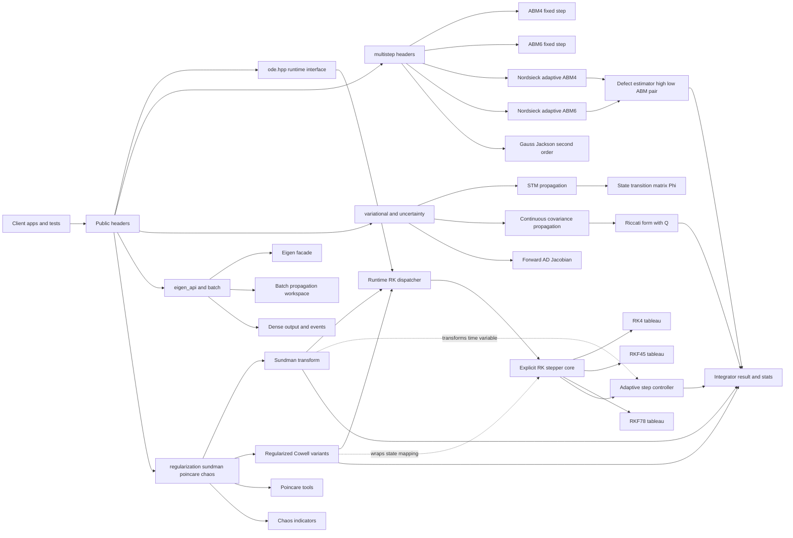

# orbitIntegrator

Author: Watson

C++20 ODE integration toolkit with explicit RK, multistep, stiffness helpers, and variational propagation:
- Explicit RK methods: RK4, RKF45, RKF78, RK8 alias
- Multistep methods: ABM4, ABM6, Nordsieck-style adaptive Adams
- Gauss-Jackson-style second-order multistep integrator
- Optional Sundman-transformed stepping mode (`integrate_sundman`)
- Regularization module (`ode::regularization`): Sundman-Cowell, Levi-Civita (2D), KS (3D)
- Dense output recording and event detection wrapper
- Separate stiff module (`ode::stiff::integrate_implicit_euler`)
- Uncertainty/variational propagation (`ode::uncertainty`) for STM and covariance
- Regularized variational propagation for Cowell+Sundman (2D/3D)
- Robust covariance numerics: Joseph-form update and square-root propagation
- Forward-mode AD Jacobian helpers
- Batch propagation helpers with reusable workspace (`ode::integrate_batch`)
- Stiffness diagnostics helper (`ode::stiff::assess_stiffness`)
- Poincare section tools and periodic-orbit differential correction (`ode::poincare`)
- Chaos indicators (FLI/MEGNO, `ode::chaos`)
- Eigen-first convenience API (`ode/eigen_api.hpp`, Eigen >= 5.0)

## Architecture



## Mathematical docs

- `docs/math_index.md`
- `docs/math_runge_kutta.md`
- `docs/math_multistep.md`
- `docs/math_variational_covariance.md`
- `docs/math_stiffness.md`
- `docs/math_regularization.md`
- `docs/math_benchmark_corpus.md`
- `docs/math_verification.md`

## Build and test

```bash
cmake --preset macos-debug
cmake --build --preset macos-debug -j
ctest --preset macos-debug --output-on-failure
```

Fetch third-party deps (fmt + Eigen 5.0.1) with CPM:

```bash
cmake --preset macos-debug -DODE_FETCH_DEPS=ON
cmake --build --preset macos-debug -j
ctest --preset macos-debug --output-on-failure
```

## Sanitizer runs

AddressSanitizer:

```bash
cmake --preset macos-asan
cmake --build --preset macos-asan -j
ctest --preset macos-asan --output-on-failure
```

UndefinedBehaviorSanitizer:

```bash
cmake --preset macos-ubsan
cmake --build --preset macos-ubsan -j
ctest --preset macos-ubsan --output-on-failure
```

## Install and package consumption

```bash
cmake --preset macos-release
cmake --build --preset macos-release -j
cmake --install build/macos-release --prefix /tmp/ode-install
```

Downstream CMake usage:

```cmake
find_package(ode CONFIG REQUIRED)
target_link_libraries(your_target PRIVATE ode::ode)
```

The repository includes a package consumer smoke test (`ode_package_install_smoke`).

## API usage

Runtime method selection:

```cpp
#include <ode/ode.hpp>
#include <vector>

using State = std::vector<double>;
State y0{1.0};

auto rhs = [](double, const State& y, State& dydt) {
  dydt.resize(y.size());
  dydt[0] = y[0];
};

ode::IntegratorOptions opt;
opt.adaptive = true;
opt.rtol = 1e-10;
opt.atol = 1e-12;

auto res = ode::integrate(ode::RKMethod::RKF78, rhs, 0.0, y0, 1.0, opt);
```

Compile-time tableau selection:

```cpp
#include <ode/integrate_method.hpp>
#include <ode/tableaus/rkf45.hpp>

auto res = ode::integrate_with_tableau<ode::TableauRKF45>(rhs, t0, y0, t1, opt);
```

Optional Sundman mode (`dt/ds` provided by caller):

```cpp
auto dt_ds = [](double t, const State& y) {
  (void)t;
  return 1.0 + 0.01 * std::abs(y[0]);  // positive scale
};
auto res = ode::integrate_sundman(ode::RKMethod::RKF78, rhs, dt_ds, t0, y0, t1, opt);
```

Regularization API:

```cpp
#include <ode/regularization.hpp>

constexpr double mu = 398600.4418;
ode::regularization::TwoBody2DState s0{7000.0, 0.0, 0.0, 7.5};
ode::regularization::RegularizationOptions ropt;
ropt.ds = 1e-4;

auto lc = ode::regularization::integrate_two_body_levi_civita(mu, 0.0, s0, 3600.0, ropt);
auto su = ode::regularization::integrate_two_body_sundman(mu, ode::RKMethod::RKF78, 0.0, s0, 3600.0, opt);
```

KS (3D):

```cpp
ode::regularization::TwoBody3DState s03{9000.0, 500.0, 1000.0, -1.0, 6.6, 0.8};
auto ks = ode::regularization::integrate_two_body_ks(mu, 0.0, s03, 7200.0, ropt);
```

Full Cowell dynamics with regularized Sundman stepping (recommended production path for perturbed models):

```cpp
auto accel3d = [](double t, const ode::regularization::TwoBody3DState& s, std::array<double,3>& a) {
  // Fill with full force model acceleration: central + J2 + drag + SRP + ...
};
auto cowl_reg = ode::regularization::integrate_cowell_sundman_3d(
    accel3d, ode::RKMethod::RKF78, t0, s03, t1, opt, 1e-9);
```

Poincare and periodic-orbit tools:

```cpp
#include <ode/poincare.hpp>
auto sec = ode::poincare::integrate_poincare<State>(
    ode::RKMethod::RKF78, rhs, section_fn, t0, y0, t1, opt, 20);
```

Chaos indicators:

```cpp
#include <ode/chaos.hpp>
auto fli = ode::chaos::compute_fli(ode::RKMethod::RKF78, rhs, jac, t0, x0, delta0, t1, opt);
auto meg = ode::chaos::compute_megno(ode::RKMethod::RKF78, rhs, jac, t0, x0, delta0, t1, opt);
```

Dense output + events:

```cpp
ode::DenseOutputOptions<State> dense_opt{};
dense_opt.uniform_sample_dt = 0.1;
ode::EventOptions<State> event_opt{};
event_opt.function = [](double, const State& y) { return y[0] - 0.5; };
auto out = ode::integrate_with_dense_events(ode::RKMethod::RKF45, rhs, t0, y0, t1, opt, dense_opt, event_opt);
```

Stiff module example:

```cpp
#include <ode/stiff/implicit_euler.hpp>
std::vector<double> y0{1.0};
auto stiff_res = ode::stiff::integrate_implicit_euler(rhs_stiff, 0.0, y0, 1.0);
```

Multistep Adams-Bashforth-Moulton example:

```cpp
#include <ode/multistep/adams_bashforth_moulton.hpp>
ode::multistep::AdamsBashforthMoultonOptions ms_opt;
ms_opt.h = 0.01;
ms_opt.mode = ode::multistep::PredictorCorrectorMode::PECE;  // PEC | PECE | Iterated
ms_opt.corrector_iterations = 2;  // used when mode == Iterated
auto ms_res = ode::multistep::integrate_abm4(rhs, t0, y0, t1, ms_opt);
```

Higher-order ABM6:

```cpp
auto ms6_res = ode::multistep::integrate_abm6(rhs, t0, y0, t1, ms_opt);
```

Nordsieck-style adaptive Adams:

```cpp
#include <ode/multistep/nordsieck_abm4.hpp>
ode::multistep::NordsieckAbmOptions nopt;
nopt.rtol = 1e-8;
nopt.atol = 1e-12;
auto nres = ode::multistep::integrate_nordsieck_abm4(rhs, t0, y0, t1, nopt);
auto nres6 = ode::multistep::integrate_nordsieck_abm6(rhs, t0, y0, t1, nopt);
```

Gauss-Jackson-style second-order integration:

```cpp
#include <ode/multistep/gauss_jackson8.hpp>
std::vector<double> r0{1.0}, v0{0.0};
auto accel = [](double, const std::vector<double>& r, const std::vector<double>&, std::vector<double>& a) {
  a.resize(1);
  a[0] = -r[0];
};
ode::multistep::GaussJackson8Options gj_opt;
gj_opt.h = 0.01;
auto gj = ode::multistep::integrate_gauss_jackson8(accel, 0.0, r0, v0, 6.283185307179586, gj_opt);
```

Uncertainty propagation (state + STM + covariance):

```cpp
#include <ode/uncertainty.hpp>

using State = ode::DynamicState;
using Matrix = ode::DynamicMatrix;

auto dynamics = [](double t, const auto& x, auto& dxdt) {
  dxdt.resize(2);
  dxdt[0] = x[1];
  dxdt[1] = -2.0 * x[0] - 3.0 * x[1];
};

auto jac_ad = [&dynamics](double t, const State& x, Matrix& a) {
  return ode::uncertainty::jacobian_forward_ad(dynamics, t, x, a);
};

auto q_const = [](double, const State& x, Matrix& q) {
  q.assign(x.size() * x.size(), 0.0);
  q[0] = 1e-6;
  q[3] = 1e-6;
  return true;
};

State x0{1.0, 0.0};
Matrix p0{1e-3, 0.0, 0.0, 1e-3};
ode::IntegratorOptions opt;

auto out = ode::uncertainty::integrate_state_stm_cov(
    ode::RKMethod::RKF78, dynamics, jac_ad, q_const, 0.0, x0, p0, 10.0, opt);
```

Variational aliases (model-agnostic naming):

```cpp
#include <ode/variational.hpp>
auto out = ode::variational::integrate_state_stm_cov(
    ode::RKMethod::RKF78, rhs, jacobian, q_fn, t0, x0, p0, t1, opt);

auto out_nordsieck = ode::variational::integrate_state_stm_cov_nordsieck_abm6(
    rhs, jacobian, q_fn, t0, x0, p0, t1, nopt);
```

Batch propagation:

```cpp
#include <ode/batch.hpp>
std::vector<ode::BatchTask<std::vector<double>>> tasks{
  {.t0 = 0.0, .t1 = 1.0, .y0 = {1.0}},
  {.t0 = 0.0, .t1 = 2.0, .y0 = {2.0}},
};
ode::BatchWorkspace<std::vector<double>> ws;
auto results = ode::integrate_batch(ode::RKMethod::RKF78, rhs, tasks, opt, &ws);
```

Eigen-first API:

```cpp
#include <ode/eigen_api.hpp>

using Vec = ode::eigen::Vector;
Vec y0(2);
y0 << 1.0, 0.0;

auto rhs = [](double, const Vec& y, Vec& dydt) {
  dydt.resize(2);
  dydt(0) = y(1);
  dydt(1) = -y(0);
};

ode::IntegratorOptions opt;
auto res = ode::eigen::integrate(ode::RKMethod::RKF78, rhs, 0.0, y0, 6.283185307179586, opt);
```

## Simple 2-body orbital example

Build and run:

```bash
cmake --preset macos-debug
cmake --build --preset macos-debug -j
./build/macos-debug/ode_two_body_example
```

This integrates a circular LEO two-body problem for approximately one orbital period and prints final state and step stats.

Uncertainty-enabled two-body example (state + STM + covariance):

```bash
cmake --preset macos-debug
cmake --build --preset macos-debug -j
./build/macos-debug/ode_two_body_uncertainty_example
```

Cowell force-model example (modular perturbation stack: gravity + J2 + drag + SRP + relativity + tidal):

```bash
cmake --preset macos-debug -DODE_FETCH_DEPS=ON
cmake --build --preset macos-debug -j
./build/macos-debug/ode_cowell_force_model_example
```

## Profiling

```bash
tools/profile.sh
```

Optional overrides:
- `ODE_PERF_SAMPLES`
- `ODE_PERF_ITERATIONS`

## Method comparison benchmark

Build and run:

```bash
cmake --preset macos-debug
cmake --build --preset macos-debug -j
./build/macos-debug/ode_method_compare_benchmark
```

This prints a side-by-side comparison for:
- `RKF78(adaptive)`
- `ABM4-PEC`
- `ABM4-PECE`
- `ABM4-Iter2`
- `ABM6-Iter2`
- `Nordsieck-ABM4`
- `Nordsieck-ABM6`
- `Sundman+RKF78`

Columns:
- `runs/sec` (throughput)
- `mean_abs_err` (mean terminal absolute error vs analytic reference)
- `mean_steps` (accepted steps)
- `mean_rhs` (RHS evaluations)

Optional overrides:
- `ODE_COMPARE_SAMPLES`
- `ODE_COMPARE_ITERATIONS`

## Regularization benchmark

Build and run:

```bash
cmake --preset macos-debug -DODE_FETCH_DEPS=ON
cmake --build --preset macos-debug -j
./build/macos-debug/ode_regularization_benchmark
```

Comparison example:

```bash
./build/macos-debug/ode_regularization_compare_example
```

## Tests included

- order checks (`RK4`, `RKF45`, `RKF78`, `RK8`)
- adaptive behavior and backward integration
- robustness guards (`NaN`, `max_steps`, endpoint clamp, underflow path)
- algebra adapters (`std::array`, custom accessor algebra)
- dense output + event handling
- stiff module smoke/regression
- multistep ABM4 regression/consistency checks
- multistep ABM6 and Nordsieck regression checks
- Gauss-Jackson second-order regression checks
- canonical nonlinear ODE regression checks (Lorenz, Van der Pol, Kepler energy drift)
- Richardson/order verification checks
- reversibility consistency checks (forward/backward)
- RK stability-region characterization checks
- stiffness diagnostics checks
- covariance symmetry/PSD and continuous-vs-discrete consistency checks
- Joseph-form and square-root covariance consistency checks
- long-horizon orbital invariant checks (energy/angular momentum)
- variational FD-vs-STM trajectory checks
- regularized variational (Cowell+Sundman) parity checks
- reference benchmark corpus regression across HighEcc/LEO-drag/GEO-J2-like regimes
- dense-output accuracy regression checks
- batch API regression checks
- uncertainty STM/covariance + AD Jacobian regression checks
- variational wrapper regression checks
- install/package-consumer smoke

## API docs (Doxygen)

```bash
cmake --preset macos-debug -DODE_BUILD_DOCS=ON
cmake --build --preset macos-debug --target ode_docs
```

Generated HTML is written under `build/<preset>/docs/html/`.

## License

This project is licensed under the GNU General Public License v3.0.
See `LICENSE`.
