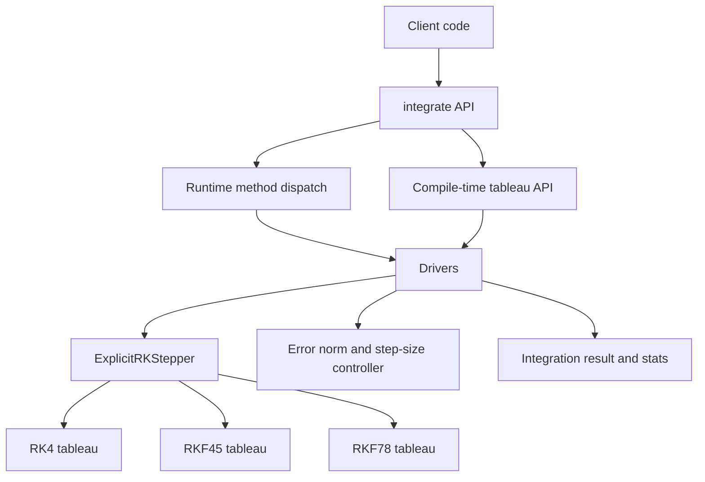

# orbitIntegrator

Author: Watson

C++20 explicit Runge-Kutta integrator for non-stiff ODEs:
- RK4 (fixed-step)
- RKF45 (embedded adaptive 4(5), fixed-step using high-order solution also supported)
- RKF78 (embedded adaptive 7(8), fixed-step using high-order solution also supported)
- RK8 alias (fixed-step using RKF78 high-order weights)

## Architecture



## Build and test

```bash
cmake --preset macos-debug
cmake --build --preset macos-debug -j
ctest --preset macos-debug --output-on-failure
```

## Sanitizer runs

AddressSanitizer:

```bash
cmake --preset macos-asan
cmake --build --preset macos-asan -j
ctest --preset macos-asan --output-on-failure
```

UndefinedBehaviorSanitizer:

```bash
cmake --preset macos-ubsan
cmake --build --preset macos-ubsan -j
ctest --preset macos-ubsan --output-on-failure
```

## Install and package consumption

```bash
cmake --preset macos-release
cmake --build --preset macos-release -j
cmake --install build/macos-release --prefix /tmp/ode-install
```

Downstream CMake usage:

```cmake
find_package(ode CONFIG REQUIRED)
target_link_libraries(your_target PRIVATE ode::ode)
```

The repository includes a package consumer smoke test (`ode_package_install_smoke`).

## API usage

Runtime method selection:

```cpp
#include <ode/ode.hpp>
#include <vector>

using State = std::vector<double>;
State y0{1.0};

auto rhs = [](double, const State& y, State& dydt) {
  dydt.resize(y.size());
  dydt[0] = y[0];
};

ode::IntegratorOptions opt;
opt.adaptive = true;
opt.rtol = 1e-10;
opt.atol = 1e-12;

auto res = ode::integrate(ode::RKMethod::RKF78, rhs, 0.0, y0, 1.0, opt);
```

Compile-time tableau selection:

```cpp
#include <ode/integrate_method.hpp>
#include <ode/tableaus/rkf45.hpp>

auto res = ode::integrate_with_tableau<ode::TableauRKF45>(rhs, t0, y0, t1, opt);
```

## Simple 2-body orbital example

Build and run:

```bash
cmake --preset macos-debug
cmake --build --preset macos-debug -j
./build/macos-debug/ode_two_body_example
```

This integrates a circular LEO two-body problem for approximately one orbital period and prints final state and step stats.

## Profiling

```bash
tools/profile.sh
```

Optional overrides:
- `ODE_PERF_SAMPLES`
- `ODE_PERF_ITERATIONS`

## API docs (Doxygen)

```bash
cmake --preset macos-debug -DODE_BUILD_DOCS=ON
cmake --build --preset macos-debug --target ode_docs
```

Generated HTML is written under `build/<preset>/docs/html/`.

## License

This project is licensed under the GNU General Public License v3.0.
See `LICENSE`.
